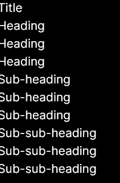
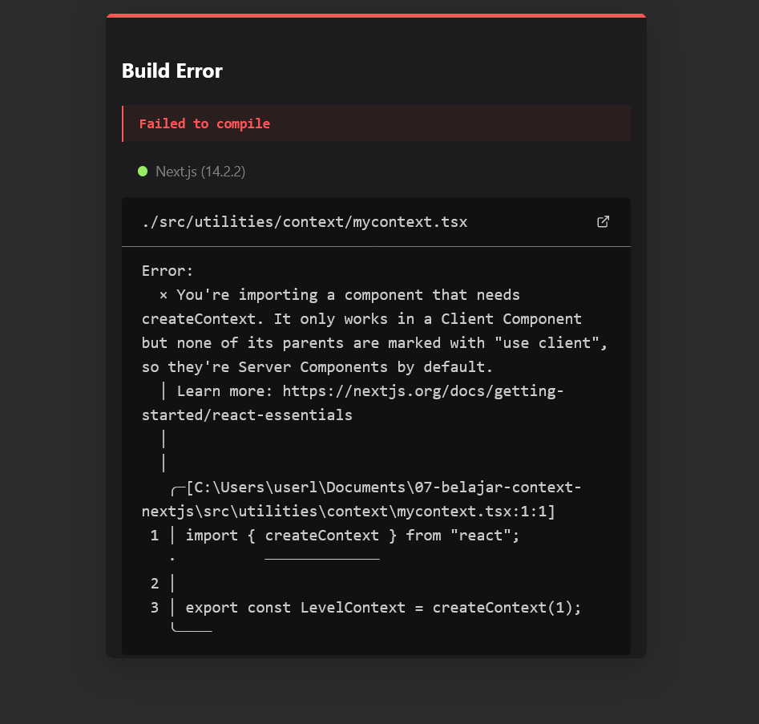

## Laporan Praktikum

|  | Pemrograman Berbasis Framework 2024 |
|--|--|
| NIM |  2141720156|
| Nama |  Versacitta Feodora Ramadhani |
| Kelas | TI - 3I |

### Practicum 1
1.  
Several text will appears from the webpage. Although there is no notable difference, these texts are divided into 4 nested sections. By using this method, we could combine several components into one. 

2.  
As mentioned above, the layout stays the same. However, there is chance that error `failed to compile` will appear. This is caused by the usage of LevelContext that requires client components. Because of this, simply add `'use client'` in `main_page.tsx` will solve the issue 

3.  
As mentioned above, the layout stays the same, with the only difference is there is no usage of level parameter in each section. 
