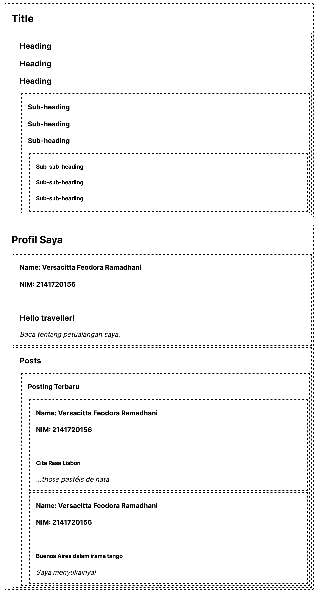
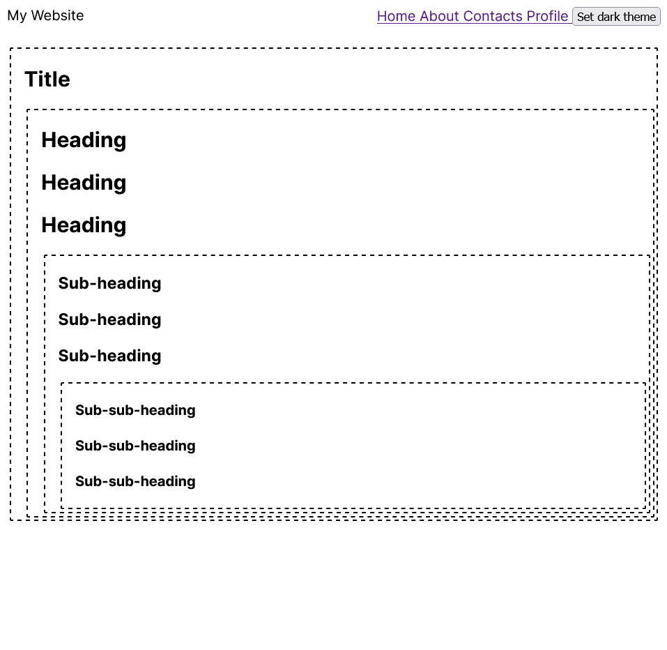
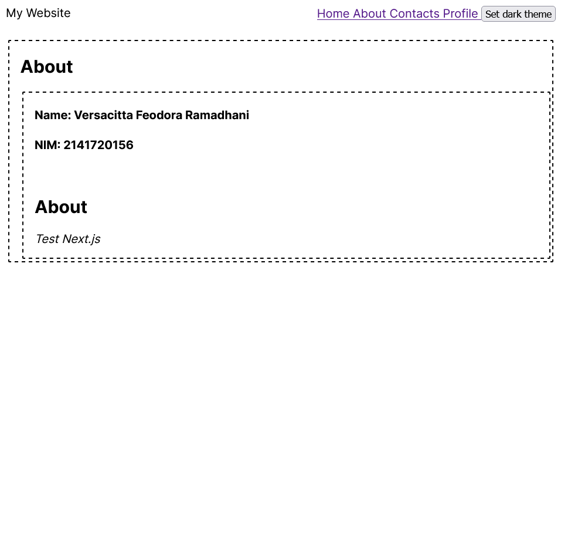
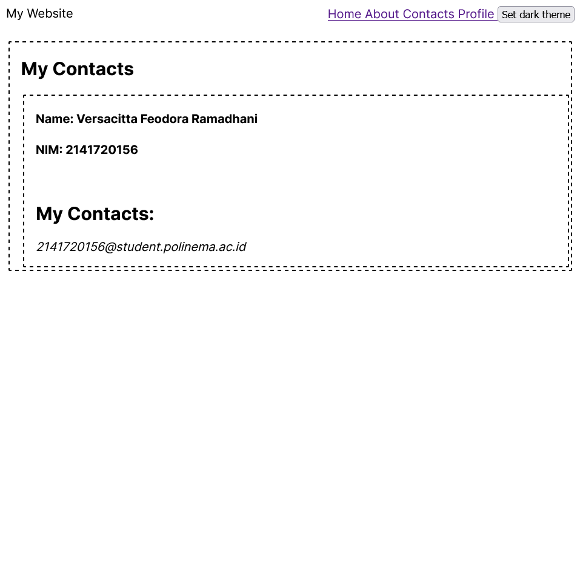
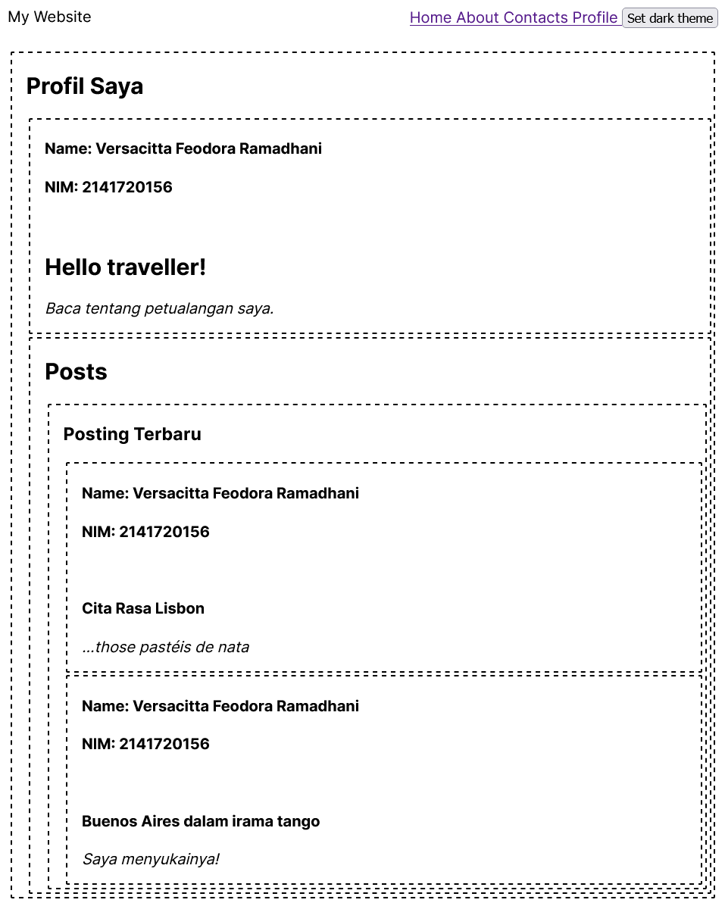
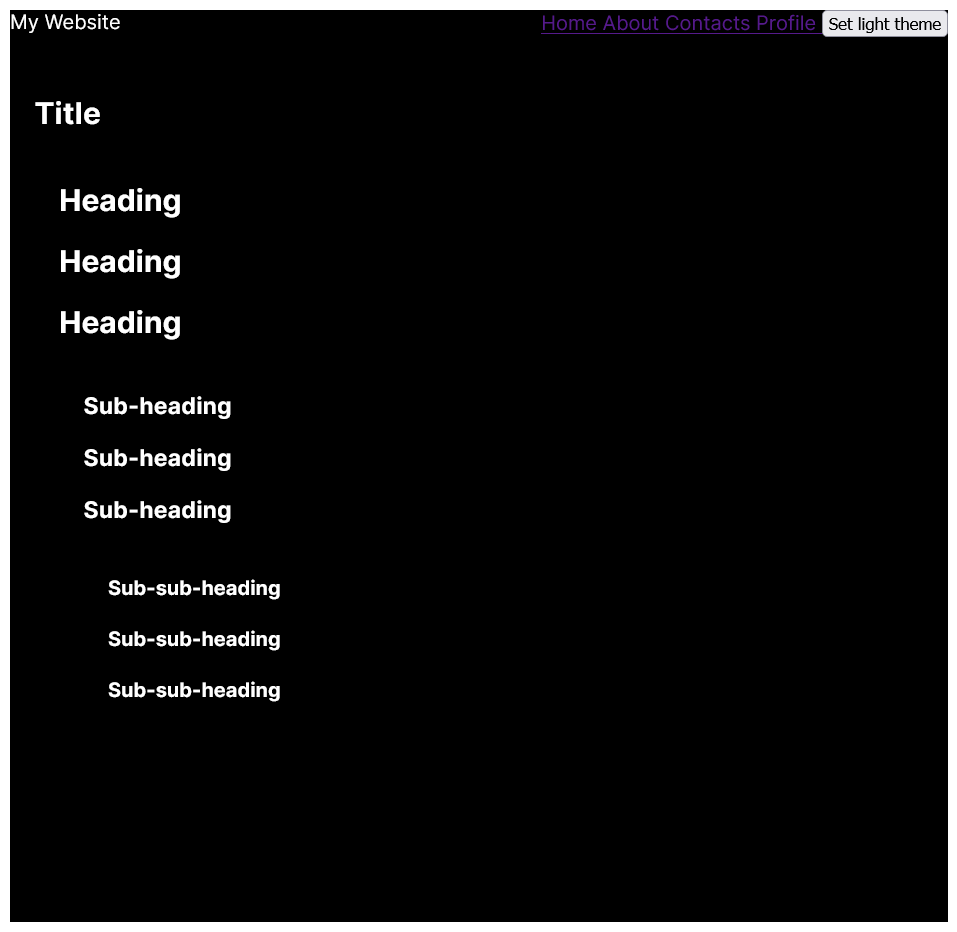
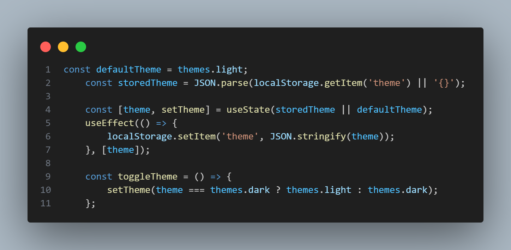

## Laporan Praktikum

|  | Pemrograman Berbasis Framework 2024 |
|--|--|
| NIM |  2141720156|
| Nama |  Versacitta Feodora Ramadhani |
| Kelas | TI - 3I |

### Practicum 1
1.  
Several text will appears from the webpage. Although there is no notable difference, these texts are divided into 4 nested sections. By using this method, we could combine several components into one. 

2.  
As mentioned above, the layout stays the same. However, there is chance that error `failed to compile` will appear. This is caused by the usage of LevelContext that requires client components. Because of this, simply add `'use client'` in `main_page.tsx` will solve the issue 

3.  
As mentioned above, the layout stays the same, with the only difference is there is no usage of level parameter in each section. 

4.  
The layout will change as above 

5.  
 
 
 
 
1. The toggle button is working as intended as shown from picture above, where the page could change from white to black 
2. If we refresh the website after changing the page and the theme, it will go back to its default state in `app/page.tsx`, which is the Main Page. This is due to how there is no method in preserving current state, so it will always revert to light theme as its initial variable. One of method that could be used is `localStorage`, in which it will save the variable of your current theme in your browser. Along with `JSON.parse` to change the variable to string, it will save the theme everytime it is changed. 
 